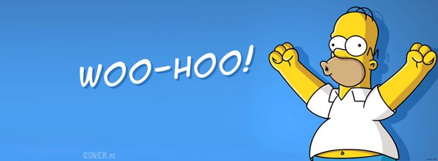

# 
Mastering Markdown

Markdown is a plain text formatting syntax for writers. It allows you to quickly write structured content for the web, and have it seamlessly converted to clean, structured HTML.

Once you get the hang of Markdown, it’s an incredibly powerful writing tool which will allow you to write rich content for the web far faster than almost any other method.

Here’s a quick example of Markdown in action:

    The *quick* brown fox, jumped **over** the lazy [dog](https://en.wikipedia.org/wiki/Dog).

becomes

The *quick* brown fox, jumped **over** the lazy [dog](https://en.wikipedia.org/wiki/Dog).

## Basic Markdown Formatting

### Headings

    # Heading 1
    ## Heading 2
    ### Heading 3

Headings in Markdown are any line which is prefixed with a # symbol. The number of hashes indicates the level of the heading. One hash is converted to an *h1*, two hashes to an *h2* and so on. There are a total of 6 levels which you can make use of - but for most writing, you’ll rarely ever need more than 3.

### Lists

    * Milk
    * Bread
        * Wholegrain
    * Butter

</blankline>

    1. Tidy the kitchen
    2. Prepare ingredients
    3. Cook delicious things

Lists are a formatting nightmare in HTML, but Markdown lists are incredibly easy to manage. For a bullet list, just prefix each like with a **\***, **-** or **+** and they will be converted to dots. You can also create nested lists; just indent a line with 4 spaces and it will be nested under the line above.

For numbered lists, do exactly the same thing - but use numbers!

### Quotes

    > To be or not to be, that is the question.

When you want to add a quote in Markdown, it’s exactly the same as the formatting which you may already be familiar with from your email app of choice when you reply to someone.

### Text

    *italic*
    **bold**
    ***bold-italic***
    [link](https://example.com)

If you want to emphasise a word a *little* bit, wrap it in asterisks. For something that needs **more** emphasis: double asterisks. If you really want to ***drive*** the point home, use triple asterisks. If you prefer, you can also use underscores - they’re completely interchangeable.

To add a link: wrap the text which you want to be linked in square brackets, followed by the URL to be linked to in parenthesis.

### Images

    

Markdown images have exactly the same formatting as a link, except they’re prefixed with a **!**. This time, the text in brackets is the descriptive text for the image.

